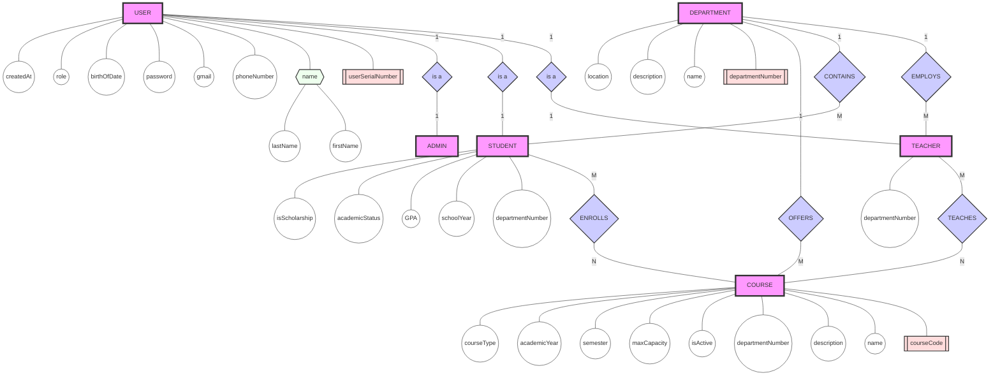
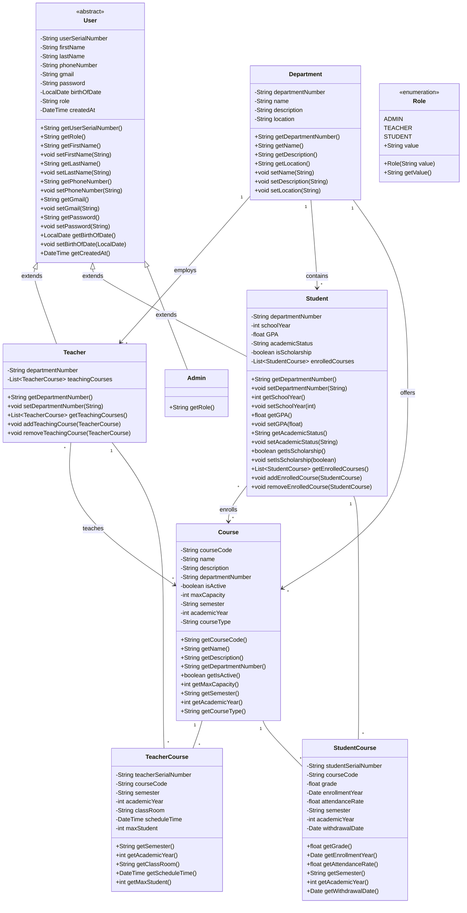

# university-system


# Database desgin

## ER flowchart



## ## Mapping

```mermaid

```

## ER Diagram

```mermaid
erDiagram
    USER {
        string userSerialNumber PK
        string firstName
        string lastName
        string phoneNumber
        string gmail
        string password
        date birthOfDate
        string role FK
        datetime createdAt
    }

    DEPARTMENT {
        string departmentNumber PK
        string name
        string description
        string location
    }

    TEACHER {
        string userSerialNumber PK, FK
        string departmentNumber FK
    }

    STUDENT {
        string userSerialNumber PK, FK
        string departmentNumber FK "DSN"
        int schoolYear
        float GPA
        string academicStatus
        boolean isScholarship
    }

    ADMIN {
        string userSerialNumber PK, FK
    }

    COURSE {
        string courseCode PK
        string name
        string description
        string departmentNumber FK
        boolean isActive "derived"
        int maxCapacity
        string semester
        int academicYear
        string courseType
    }

    TEACHER_COURSE {
        string userSerialNumber PK, FK
        string courseCode PK, FK
        string semester
        int academicYear
        string classRoom
        datetime scheduleTime
        int maxStudent
    }

    STUDENT_COURSE {
        string userSerialNumber PK, FK
        string courseCode PK, FK
        float grade
        date enrollmentYear
        float attendanceRate "derived"
        string semester
        int academicYear
        date withdrawalDate
    }

    USER ||--o| TEACHER : "is a"
    USER ||--o| STUDENT : "is a"
    USER ||--o| ADMIN : "is a"
    
    DEPARTMENT ||--|{ TEACHER : "employs"
    DEPARTMENT ||--|{ STUDENT : "contains"
    DEPARTMENT ||--|{ COURSE : "offers"
    
    TEACHER ||--|{ TEACHER_COURSE : "teaches"
    COURSE ||--|{ TEACHER_COURSE : "taught by"
    
    STUDENT ||--|{ STUDENT_COURSE : "enrolls"
    COURSE ||--|{ STUDENT_COURSE : "enrolled by"
```

## Schema Tables

1. USER Table
   
   ```sql
   CREATE TABLE USER (
       USN VARCHAR(50) PRIMARY KEY,
       first_name VARCHAR(50) NOT NULL,
       last_name VARCHAR(50) NOT NULL,
       phone_number VARCHAR(20),
       gmail VARCHAR(100) UNIQUE NOT NULL,
       password VARCHAR(255) NOT NULL,
       birth_of_date DATE,
       role ENUM('ADMIN', 'TEACHER', 'STUDENT') NOT NULL,
       created_at TIMESTAMP DEFAULT CURRENT_TIMESTAMP,
   );
   ```

2. DEPARTMENT Table
   
   ```sql
   CREATE TABLE DEPARTMENT (
       DSN VARCHAR(20) PRIMARY KEY,
       name VARCHAR(100) NOT NULL UNIQUE,
       description TEXT,
       location VARCHAR(100) NOT NULL
   );
   ```

3. TEACHER Table
   
   ```sql
   CREATE TABLE TEACHER (
       USN VARCHAR(50) PRIMARY KEY,
       DSN VARCHAR(20) NOT NULL,
       FOREIGN KEY (USN) REFERENCES USER(USN)
       FOREIGN KEY (DSN) REFERENCES DEPARTMENT(DSN)
   );
   ```

4. STUDENT Table
   
   ```sql
   CREATE TABLE STUDENT (
   	USN VARCHAR(50) PRIMARY KEY,
   	DSN VARCHAR(20) NOT NULL,
   	school_year INT NOT NULL CHECK (school_year BETWEEN 0 AND 4),
   	gpa DECIMAL(3,2) CHECK (gpa >= 0.00 AND gpa <= 4.00),
   	academic_status ENUM('ACTIVE', 'PROBATION', 'SUSPENDED', 'GRADUATED') DEFAULT 'ACTIVE',
   	is_scholarship BOOLEAN DEFAULT FALSE,
   	FOREIGN KEY (USN) REFERENCES USER(USN),
   	FOREIGN KEY (DSN) REFERENCES DEPARTMENT(DSN)
   );
   ```

5. ADMIN Table
   
   ```sql
   CREATE TABLE ADMIN (
       USD VARCHAR(50) PRIMARY KEY,
       FOREIGN KEY (USD)  REFERENCES USER(USD)
   );
   ```

6. COURSE
   
   ```sql
   CREATE TABLE COURSE (
       course_code VARCHAR(20) PRIMARY KEY,
       name VARCHAR(100) NOT NULL,
       description TEXT,
       DSN VARCHAR(20) NOT NULL,
       max_capacity INT NOT NULL CHECK (max_capacity > 0),
       semester ENUM('FALL', 'SPRING', 'SUMMER') NOT NULL,
       academic_year INT NOT NULL CHECK (academic_year >= 2000),
       course_type ENUM('MANDATORY', 'ELECTIVE', 'GENERAL') NOT NULL,
       FOREIGN KEY (DSN)  REFERENCES DEPARTMENT(DSN)
   );
   ```

7. TEACHER_COURSE
   
   ```sql
   CREATE TABLE TEACHER_COURSE (
       USD VARCHAR(50),
       course_code VARCHAR(20),
       semester ENUM('FALL', 'SPRING', 'SUMMER') NOT NULL,
       academic_year INT NOT NULL CHECK (academic_year >= 2000),
       class_room VARCHAR(50) NOT NULL,
       schedule_time TIMESTAMP NOT NULL,
       max_student INT NOT NULL CHECK (max_student > 0,
       PRIMARY KEY (USD, course_code, semester, academic_year),
       FOREIGN KEY (USD) REFERENCES TEACHER(USD),
       FOREIGN KEY (course_code) REFERENCES COURSE(course_code),
   );
   ```

8. STUDENT_COURSE
   
   ```sql
   CREATE TABLE STUDENT_COURSE (
       USD VARCHAR(50),
       course_code VARCHAR(20),
       grade DECIMAL(4,2) CHECK (grade >= 0.00 AND grade <= 100.00),
       enrollment_year DATE NOT NULL,
       attendance_rate DECIMAL(5,2) DEFAULT 0.00  CHECK (attendance_rate >= 0.00 AND attendance_rate <= 100.00),
       semester ENUM('FALL', 'SPRING', 'SUMMER') NOT NULL,
       academic_year INT NOT NULL CHECK (academic_year >= 2000),
       withdrawal_date DATE CHECK (withdrawal_date >= enrollment_year),
       PRIMARY KEY (USD, course_code, semester, academic_year),
       FOREIGN KEY (USD) REFERENCES STUDENT(USD),
       FOREIGN KEY (course_code) REFERENCES COURSE(course_code)
   );
   ```
   
   

---

# UML Diagram

