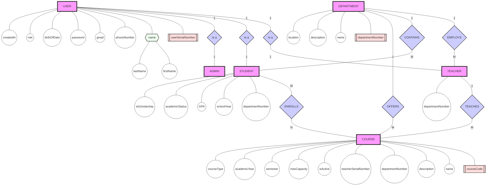
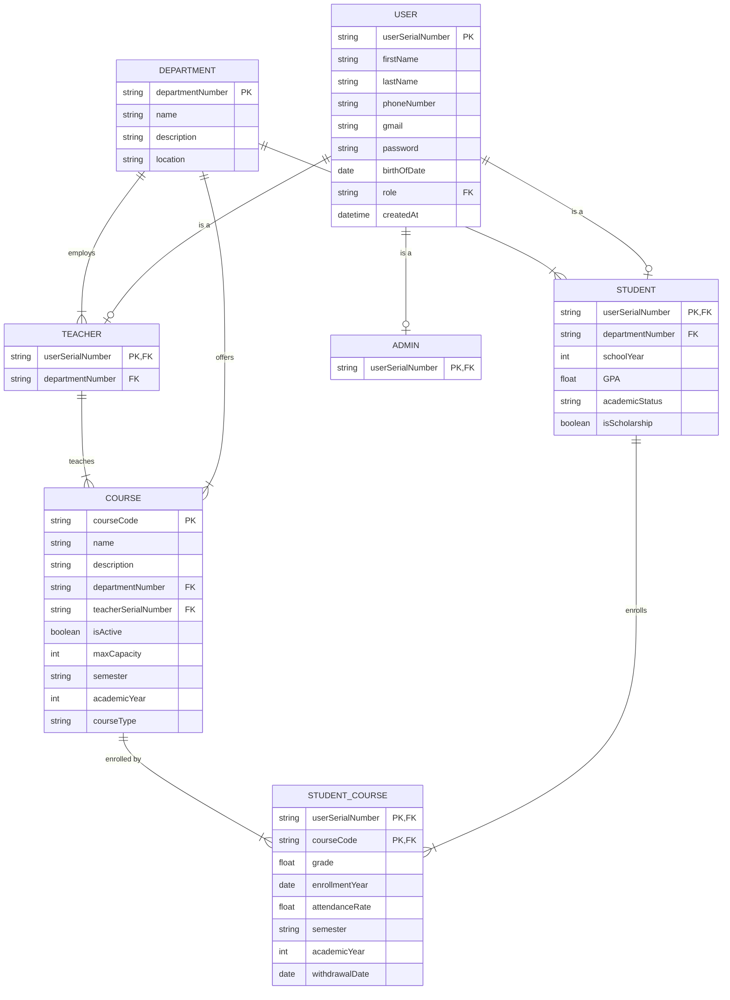
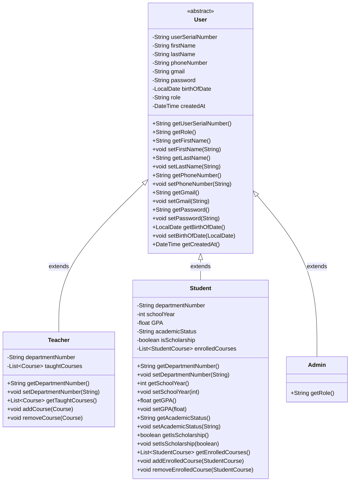

# EduMatrix™


EduMatrix is an enterprise-grade university management system that transforms academic operations through innovative digital solutions. Our comprehensive platform streamlines administrative workflows, enhances academic oversight, and elevates institutional efficiency.

---

# Table of Contents
- [Core Capabilities](#core-capabilities)
- [Key Features](#key-features)
  - [Academic Management](#academic-management)
  - [User Management](#user-management)
  - [Department Operations](#department-operations)
  - [Process Automation](#process-automation)
- [Database Design](#database-design)
  - [Entity-Relationship Flowchart](#entity-relationship-flowchart)
  - [ER Diagram](#er-diagram)
  - [Database Schema](#database-schema)
  - [Constraints](#constraints)
  - [ENUMs](#enums)
    - [User Role](#user-role)
    - [Academic Status](#academic-status)
    - [Semester](#semester)
    - [Course Type](#course-type)
- [UML Class Diagram](#uml-class-diagram)
  - [User Management Diagram](#user-management-diagram)
  - [Academic Structure Diagram](#academic-structure-diagram)
  - [Course Relationships Diagram](#course-relationships-diagram)

# Core Capabilities

- **Seamless Integration**: Unified platform for all administrative and academic processes
- **Intelligent Automation**: Smart workflows that reduce manual intervention
- **Real-time Analytics**: Data-driven insights for informed decision-making
- **Scalable Architecture**: Built to grow with your institution
- **Secure Infrastructure**: Enterprise-level security protocols

# Key Features

🎓 **Academic Management**
- Comprehensive course administration
- Dynamic curriculum planning
- Automated enrollment processing

👥 **User Management**
- Role-based access control
- Integrated faculty administration
- Student lifecycle management

📊 **Department Operations**
- Resource allocation optimization
- Performance analytics
- Departmental collaboration tools

🔄 **Process Automation**
- Streamlined workflows
- Automated reporting
- Intelligent scheduling

# Database Design

## Entity-Relationship Flowchart



## ER Diagram



## Database Schema

1. USER Table
```sql
CREATE TABLE USER (
    userSerialNumber VARCHAR(50) PRIMARY KEY,
    firstName VARCHAR(50) NOT NULL,
    lastName VARCHAR(50) NOT NULL,
    phoneNumber VARCHAR(20),
    gmail VARCHAR(100) UNIQUE NOT NULL,
    password VARCHAR(255) NOT NULL,
    birthOfDate DATE,
    role ENUM('ADMIN', 'TEACHER', 'STUDENT') NOT NULL,
    createdAt TIMESTAMP DEFAULT CURRENT_TIMESTAMP
);
```

2. DEPARTMENT Table
```sql
CREATE TABLE DEPARTMENT (
    departmentNumber VARCHAR(20) PRIMARY KEY,
    name VARCHAR(100) NOT NULL UNIQUE,
    description TEXT,
    location VARCHAR(100) NOT NULL
);
```

3. TEACHER Table
```sql
CREATE TABLE TEACHER (
    userSerialNumber VARCHAR(50) PRIMARY KEY,
    departmentNumber VARCHAR(20) NOT NULL,
    FOREIGN KEY (userSerialNumber) REFERENCES USER(userSerialNumber),
    FOREIGN KEY (departmentNumber) REFERENCES DEPARTMENT(departmentNumber)
);
```

4. STUDENT Table
```sql
CREATE TABLE STUDENT (
    userSerialNumber VARCHAR(50) PRIMARY KEY,
    departmentNumber VARCHAR(20) NOT NULL,
    schoolYear INT NOT NULL CHECK (schoolYear BETWEEN 0 AND 4),
    GPA DECIMAL(3,2) CHECK (GPA >= 0.00 AND GPA <= 4.00),
    academicStatus ENUM('ACTIVE', 'PROBATION', 'SUSPENDED', 'GRADUATED') DEFAULT 'ACTIVE',
    isScholarship BOOLEAN DEFAULT FALSE,
    FOREIGN KEY (userSerialNumber) REFERENCES USER(userSerialNumber),
    FOREIGN KEY (departmentNumber) REFERENCES DEPARTMENT(departmentNumber)
);
```

5. ADMIN Table
```sql
CREATE TABLE ADMIN (
    userSerialNumber VARCHAR(50) PRIMARY KEY,
    FOREIGN KEY (userSerialNumber) REFERENCES USER(userSerialNumber)
);
```

6. COURSE Table
```sql
CREATE TABLE COURSE (
    courseCode VARCHAR(20) PRIMARY KEY,
    name VARCHAR(100) NOT NULL,
    description TEXT,
    departmentNumber VARCHAR(20) NOT NULL,
    teacherSerialNumber VARCHAR(50) NOT NULL,
    isActive BOOLEAN DEFAULT TRUE,
    maxCapacity INT NOT NULL CHECK (maxCapacity > 0),
    semester ENUM('FALL', 'SPRING', 'SUMMER') NOT NULL,
    academicYear INT NOT NULL CHECK (academicYear >= 2000),
    courseType ENUM('MANDATORY', 'ELECTIVE', 'GENERAL') NOT NULL,
    FOREIGN KEY (departmentNumber) REFERENCES DEPARTMENT(departmentNumber),
    FOREIGN KEY (teacherSerialNumber) REFERENCES TEACHER(userSerialNumber)
);
```

7. STUDENT_COURSE Table
```sql
CREATE TABLE STUDENT_COURSE (
    userSerialNumber VARCHAR(50),
    courseCode VARCHAR(20),
    grade DECIMAL(4,2) CHECK (grade >= 0.00 AND grade <= 100.00),
    enrollmentYear DATE NOT NULL,
    attendanceRate DECIMAL(5,2) DEFAULT 0.00 CHECK (attendanceRate >= 0.00 AND attendanceRate <= 100.00),
    semester ENUM('FALL', 'SPRING', 'SUMMER') NOT NULL,
    academicYear INT NOT NULL CHECK (academicYear >= 2000),
    withdrawalDate DATE CHECK (withdrawalDate >= enrollmentYear),
    PRIMARY KEY (userSerialNumber, courseCode, semester, academicYear),
    FOREIGN KEY (userSerialNumber) REFERENCES STUDENT(userSerialNumber),
    FOREIGN KEY (courseCode) REFERENCES COURSE(courseCode)
);
```

### Constraints:
- School Year: 0-4
- GPA: 0.00-4.00
- Grade: 0.00-100.00
- Attendance Rate: 0.00%-100.00%
- Academic Year: ≥ 2000
- Maximum Capacity: > 0

### ENUMs:
1. User Role:
   - ADMIN
   - TEACHER
   - STUDENT

2. Academic Status:
   - ACTIVE
   - PROBATION
   - SUSPENDED
   - GRADUATED

3. Semester:
   - FALL
   - SPRING
   - SUMMER

4. Course Type:
   - MANDATORY
   - ELECTIVE
   - GENERAL

# UML Class Diagram

## User Management Diagram



## Academic Structure Diagram

```mermaid
classDiagram
    %% Academic Structure Diagram
    Department "1" --> "*" Teacher : employs
    Department "1" --> "*" Student : contains
    Department "1" --> "*" Course : offers
    Teacher "1" --> "*" Course : teaches

    class Department {
        -String departmentNumber
        -String name
        -String description
        -String location
        +String getDepartmentNumber()
        +String getName()
        +void setName(String)
        +String getDescription()
        +void setDescription(String)
        +String getLocation()
        +void setLocation(String)
    }

    class Course {
        -String courseCode
        -String name
        -String description
        -String departmentNumber
        -String teacherSerialNumber
        -boolean isActive
